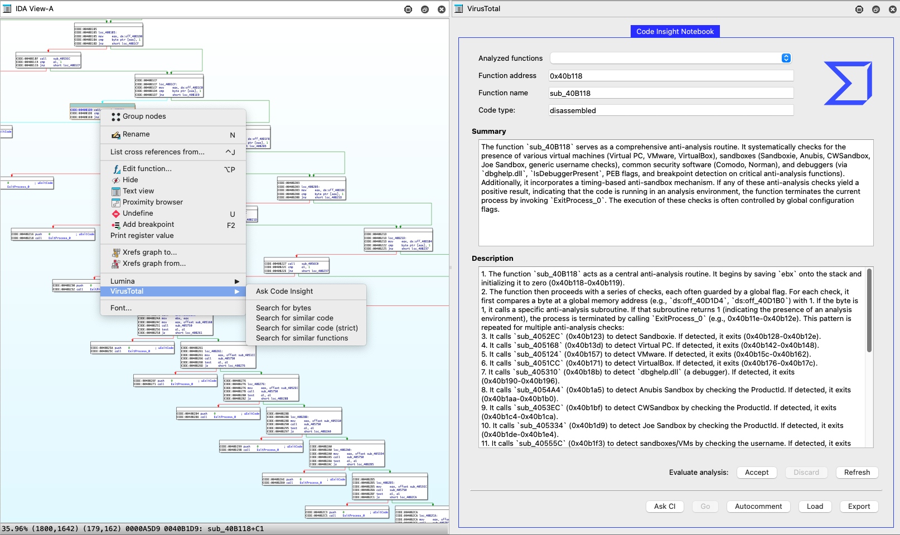

# VirusTotal Plugin for IDA Pro

This is the official VirusTotal plugin for Hex-Rays IDA Pro, version **1.04**. It seamlessly integrates VirusTotal's powerful analysis capabilities directly into your reverse engineering workflow.

The plugin offers two core functionalities:
1.  **Code Similarity Search**: Perform advanced searches for code, bytes, and strings across VirusTotal's massive dataset directly from IDA's disassembly and strings views.


2.  **Code Insight Notebook**: Leverage VirusTotal's Code Insight to get summaries and descriptions of functions. Keep track of your findings in a persistent, shareable notebook within the IDA sidebar.



## Features

### Code Insight Notebook

The Code Insight Notebook is a powerful feature that lives in its own dockable panel (`View -> Open subviews -> VirusTotal`).

- **Code Insight Analysis**: Request an AI-generated summary and detailed description for any function (disassembled or decompiled).
- **Persistent Workspace**: All analyses are saved in a "notebook" that can be loaded again across IDA sessions.
- **Edit and Refine**: You can edit the AI-generated analysis to correct it or add your own insights.
- **Automatic Commenting**: Automatically populate IDA's function comments with the analysis summary for all functions in your notebook.
- **Import/Export**: Share your analysis with colleagues by exporting the notebook to a JSON file, or import one to get up to speed on a shared binary.

### Code Similarity Search (Right-Click Context Menu)

From the **Disassembly View**:

- **Search for bytes**: Performs a raw byte search in VirusTotal for the selected sequence.
- **Search for similar code**: Searches for functionally similar code by wildcarding memory addresses and offsets.
- **Search for similar code (strict)**: A more aggressive version of the above that also wildcards all immediate values (constants).
- **Search for similar functions**: Automatically detects the boundaries of the current function and searches for similar functions, so you don't have to select it manually.

From the **Strings View**:

- **Search for string**: Searches for the selected string(s) in VirusTotal.

## Requirements

- **IDA Pro**: Tested with versions 8 or newer. Please note that IDA Pro v9.2+ requires PySide6.
- **Python**: Use Python Version 3.x with the requests module. Version 3.9 and later are recommended.
- **VirusTotal API Key**: A valid VirusTotal API key is **required** for using Code Insight. VTGrep searches rely on an active VirusTotal Enterprise session in your web browser.

## Installation

1.  Install the `requests` module for Python:
    ```bash
    $ pip install requests
    ```
2.  Copy the entire `plugins/virustotal` directory into your IDA Pro plugins folder.

| OS      | Default Plugin Path             |
| ------- | ------------------------------- |
| Linux   | `/opt/ida-pro-X.X/plugins`      |
| macOS   | `~/.idapro/plugins`             |
| Windows | `%ProgramFiles%\IDA Pro X.X\plugins`|

3.  Start IDA Pro.

## Configuration

### First-Time Run

On the first run, the plugin will ask for your consent to automatically upload samples to VirusTotal. This choice is saved in a configuration file.

- **OK**: Agree to the terms and enable automatic uploads for files not found on VirusTotal.
- **No**: Disable automatic uploads.
- **Cancel**: Disable the plugin for the current session.

### API Key

To use the **Code Insight** features, you must add your VirusTotal API key to the configuration file:

1.  Locate the configuration file: `[USER_IDA_DIR]/plugins/virustotal/config.py`
2.  Open the file and add your key:
    ```ini
    API_KEY = 'YOUR_VT_API_KEY_HERE'
    ```

The plugin creates a `virustotal.conf` file in your user IDA directory (e.g., `%APPDATA%\Hex-Rays\IDA Pro` on Windows or `~/.idapro` on macOS/Linux) to store your preferences.

## Usage

### Code Insight Notebook

1.  Open the panel via `View -> Open subviews -> VirusTotal`.
2.  In the IDA Disassembly or Decompiler view, place your cursor inside a function.
3.  Right-click and select `VirusTotal -> Ask Code Insight` or just click on the `Ask CI` button in the `Code Insight Notebook` panel.
4.  The analysis will appear in the VirusTotal panel. You can now:
    - Edit the summary or description.
    - Click **Accept** to save the analysis (including your edits) to the notebook.
    - Click **Discard** to remove the analysis.
    - Click **Autocomment** to add all saved analyses as comments to their respective functions in IDA.

### Code Similarity Search

1.  In the Disassembly or Strings view, select a piece of code or a string.
2.  Right-click and choose the desired search option under the `VirusTotal` menu.
3.  A new tab will open in your default web browser with the VTGrep search results.

### Usage examples

In this VirusTotal blog post, we use practical examples to demonstrate how to get the most out of the tool:

https://blog.virustotal.com/2025/08/integrating-code-insight-into-reverse.html

## Supported Architectures

The "Search for similar code" features are fully supported on the following processor architectures:
- **Intel x86/x64** (metapc)
- **ARM**

While other architectures may work, they have not been officially tested. Raw byte and string searches work on all architectures.

Check IDA Pro's output window for any message that may need your attention.

## Changelog
- v1.04 : Fixes issue that left IDA hanging while a query was being performed.
- v1.03 : BUG fixed (wrongly showing an invalid api key msg)
- v1.02 : Added support for IDA Pro 9.2
- v1.00 : Added Code Insight panel
- v0.11 : Added support for IDA Pro 8.x
- v0.10 : Initial release
